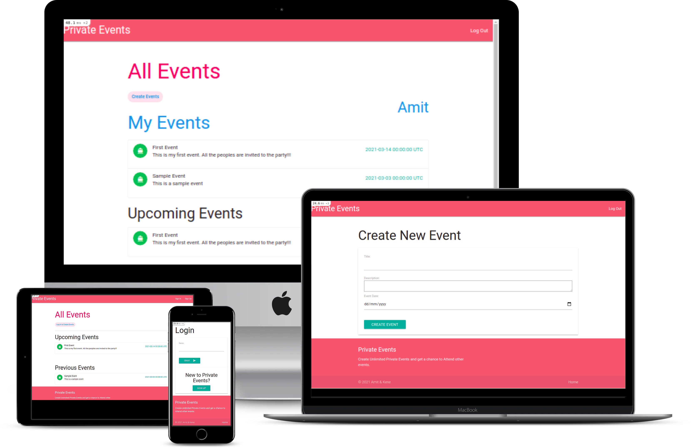

# Private Events


Private events is a web app that allows users
to sign up/sign in. Users can create events; events have a title and a description, and take
place on a specific date. A user can attend many events. An event can be attended by many
users.



## Built With 🛠

```
- Ruby: 2.7.2
- Ruby on Rails: 6.1.3
- SQLite
- Materialize
```

## Install ⏳

> Follow these steps below to get our application working

1. - [ ] Open your `Terminal`
2. - [ ] Navigate to the directory where you will like to install the repo by running `cd FOLDER-NAME`
3. - [ ] Run `git clone git@github.com:KumarAmitt/Private-Events.git` to download <b>or</b> you can download using `HTTPS` by running `git clone https://github.com/KumarAmitt/Private-Events.git` in the terminal
4. - [ ] Run `cd Private-Events` to enter directory
5. - [ ] Run `bundle install` to install Ruby Gems.
6. - [ ] Run `rails db:create` to create your database
7. - [ ] Run `rails db:migrate` to migrate your database
8. - [ ] Run `rails s` to get the server running
9. - [ ] Enter `http://localhost:3000/` in the browser to get the app running

## Testing

In order to run the tests, RSPEC should be installed.

- Please run the following command line in your terminal to install :

```bash
gem install rspec
```

- When the installation is complete, type this command inside `Private-Events` folder to run the tests :

```bash
rspec
```

## Authors

### 👨‍💻 Kenechukwu Oguagbaka

- GitHub: [@keneogu](https://github.com/keneogu)
- Twitter: [@keneogu](https://twitter.com/keneogu)
- LinkedIn: [@keneogu](https://www.linkedin.com/in/kene-ogu/)

### 👨‍💻 Amit Kumar

- GitHub: [@KumarAmitt](https://github.com/KumarAmitt)
- Twitter: [@ArrshAmit](https://twitter.com/ArrshAmitt)
- LinkedIn: [@kumar-amitt](https://www.linkedin.com/in/kumar-amitt)

### 🤝 Contributing

Contributions, issues and feature requests are welcome!

- Fork the project
- Create your feature branch `git checkout -b feature`
- Commit your changes `git commit -m 'feature'`
- Push it `git push -u origin feature`
- Open a pull request using this branch


Feel free to check the [issues page](https://github.com/KumarAmitt/Private-Events/issues).

### Show your support

Give a ⭐️ if you like this project!

### License

&copy; 2020 Amit Kumar & Kenechukwu Oguagbaka

Permission is hereby granted, free of charge, to any person obtaining a copy
of this software and associated documentation files (the "Software"), to deal
in the Software without restriction, including without limitation the rights
to use, copy, modify, merge, publish, distribute, sublicense, and/or sell
copies of the Software, and to permit persons to whom the Software is
furnished to do so, subject to the following conditions:

The above copyright notice and this permission notice shall be included in all
copies or substantial portions of the Software.

THE SOFTWARE IS PROVIDED "AS IS", WITHOUT WARRANTY OF ANY KIND, EXPRESS OR
IMPLIED, INCLUDING BUT NOT LIMITED TO THE WARRANTIES OF MERCHANTABILITY,
FITNESS FOR A PARTICULAR PURPOSE AND NONINFRINGEMENT. IN NO EVENT SHALL THE
AUTHORS OR COPYRIGHT HOLDERS BE LIABLE FOR ANY CLAIM, DAMAGES OR OTHER
LIABILITY, WHETHER IN AN ACTION OF CONTRACT, TORT OR OTHERWISE, ARISING FROM,
OUT OF OR IN CONNECTION WITH THE SOFTWARE.
